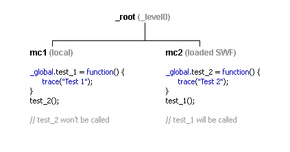
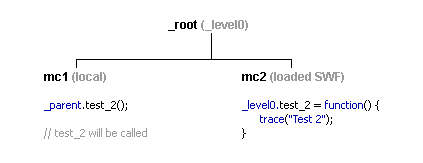

Like many Flash developers, I like writing classes and optimizing bandwidth with remote libraries. ActionScript 1 uses prototypes to extend methods to a function object, and to be able to access that class globally, one would use `_global`. Unfortunately, globals do not work as well as they're explained to. This bug is resident in all minor versions of Flash Player 6, and still exists in Flash Player 7. <!--more-->

Global variables, functions, objects and prototyped methods will work perfectly if only developing a single SWF site or application. Though, when developing with multiple SWF files, those procedures must be defined in a loaded timeline that is a child of or parent to the caller. Therefore, defining such in a SWF that is dynamically loaded into a MovieClip in `_root` will not be accessible to any MovieClip instantiated as a child or nested child of `_root`.

Since the above paragraph is a lot to soak in, let's create an example. In the root timeline, we'd have a manually created MovieClip with the instance name "mc1", and on frame 1 (of the root timeline), we'd have the following code:

```actionscript
createEmptyMovieClip("mc2", 0);

mc2.loadMovie("example.swf");
```

The structure would look like this:



Here, you can see that `test_1` is invoked while `test_2` is not. The reason for this is because `test_1` is defined inside the main SWF and is set to global, meanwhile `test_2` is defined in a remote file and can only be called from within that timeline, any sibling and/or direct parent timeline even though it too has been declared as global. This is the bug that is still yet to be resolved by Macromedia.

If you try to trace the `test_2` in Flash Player 6, it will return "Warning”. It has since been removed in version 7.

## Workaround

There are ways to work around this, but it takes away from the neatness of your code. When declaring, do so by pointing to the main SWF. Notice the use of `_level0` as opposed to `_root`. That way, whenever declaring and calling that variable, function or object, it may be done so from any timeline. Unfortunately, this doesn't solve the same problem with methods added to predefined objects like MovieClip and String. Such methods would have to be defined in the main SWF.



An example of creating a globally accessible class in ActionScript 1 from a loaded SWF would look as follows:

```actionscript
with (_level0)
{
  function className(msg)
  {
    this.msg = msg;
    this.init();
  }

  className.prototype.init = function()
  {
    trace(this.msg);
  }
}

classInstance = new _level0.className("test");
```

Macromedia seems to have solved the problem for ActionScript 2 classes. An example of creating a globally accessible class in such from a loaded SWF would look like any other class:

```actionscript
class ClassName
{
  private var _msg:String;

  public function ClassName(msg)
  {
    _msg = msg;
    init();
  }

  private function init()
  {
    trace(_msg);
  }
}

var classInstance:ClassName = new ClassName("test");
```

## Conclusion

As to why Macromedia would choose to fix the bug for ActionScript v2 and not v1, I can only assume that they just didn't care. They are obviously trying to force everyone onto the new syntax. To keep file sizes down, I prefer to stick with MX and prototyped classes even though this bug can complicate things a little. I realize that ActionScript can be compiled from v2 into v1 from MX 2004, but at this point, I wouldn't trust Macromedia with that.
