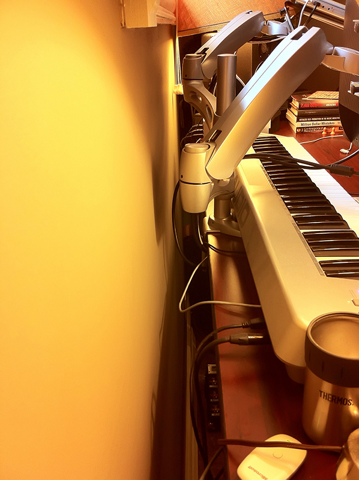
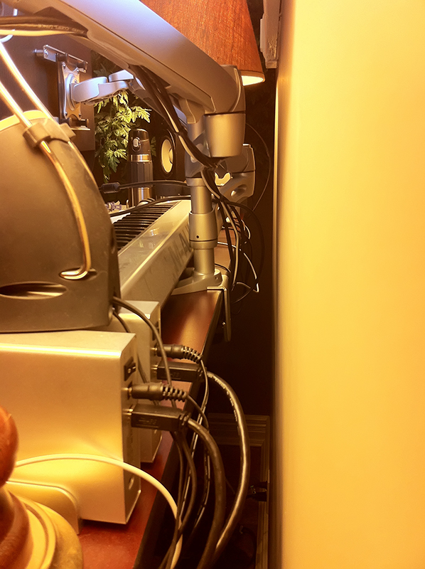
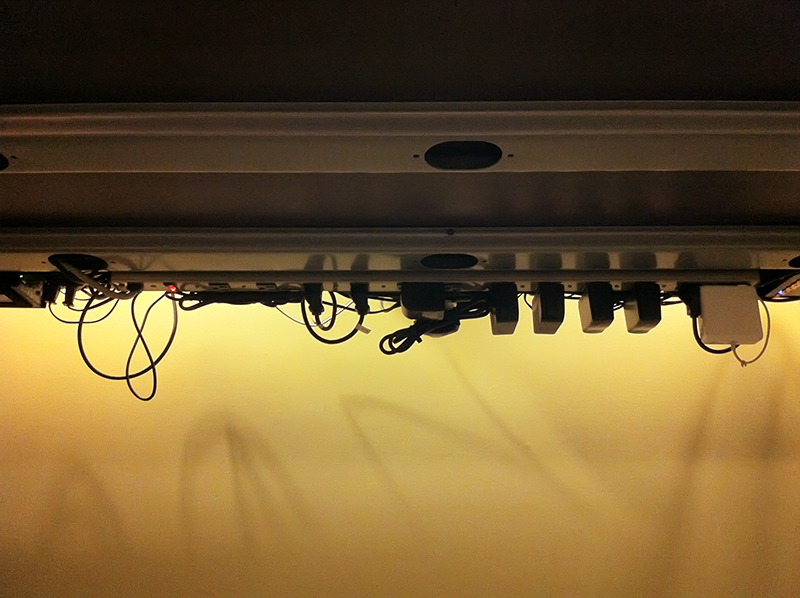

Apparently, I have a computer job.

Sitting at the desk all day takes its toll on your shoulders and eventually your health, so I decided to purchase an elevating, or "height-adjustable" desk. Exercise aside, I am now healthier, always comfortable and get more work done in less time as I require fewer body breaks.

There was a downside to this, however: the cables! <!--more--> Grabbing inspiration from [decluttered.com](http://www.decluttered.com/), I put together something a little different, and _simpler_ in my opinion.

I also needed more desk space. With a pair of desk-mounted arms, I was able to get both my monitor and laptop off of the desk's surface.

I'd been expanding this over the passed few years and have finally gotten it to the point where it may be of some interest to others.

Here is what I used:

1. [Conset 501-11](http://www.conset.com/product/prodone/4356/default.aspx) desk frame
2. [Ergotron LX](http://www.ergotron.com/Products/tabid/65/PRDID/355/language/en-US/Default.aspx) arms
3. Copper or steel strapping aka suspension straps
4. Round releasable cable clamps or tie wrap mounts
5. Cable tie wraps (black)
6. Screws

https://www.youtube.com/watch?v=uLTqpjKJN5o

