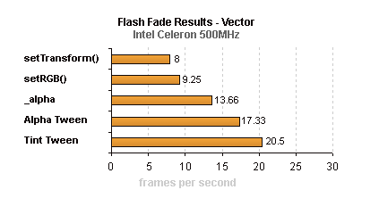
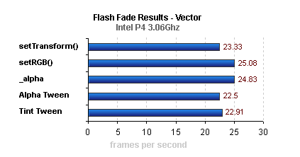
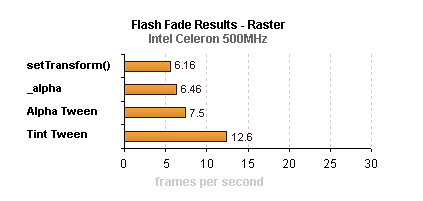
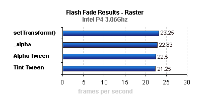

Is it just me, or do many Flash developers have no regard for slower computers? Do they believe that every single person on the Internet has a 3 GHz machine? I mean, come on! I have a 3 GHz machine, but if all I did was develop in Flash, I wouldn’t need such a computer. Neither do many of the other 400,000,000 people on the Internet. <!--more-->

It’s like a recurring theme. Improper use of ActionScript and Flash in general can cause annoying problems, especially on older and slower computers that don’t as easily hide one’s mistakes. The Flash player is not perfect and not everyone can afford a decent computer for entertainment uses. You have to properly understand your audience to properly cater to them and their preferences. Many people purchase computers for basic Internet and email usage and not multimedia. So your work can’t be expected to perform the same for everyone.

Testing on a few machines is a good idea. Each with dual booted Operating Systems and a slew of browsers is a plus.

In this article, we’ll discuss some of the ways in which you can properly optimize your code and your design theories with Flash so that you can avoid lag issues, thereby reaching a larger audience.

## Use Fewer Images

The Flash Player is a vector based program. It will display raster images but because it’s not its main purpose, it will perform quite poorly. Especially in high quality---we’ll get into this more in the next segment. Images will play fine as long as they’re static or animated sparingly and are not large in dimension. The larger they are, the more CPU they’ll require.

The same applies to masked images, whether scripted or layered. If an 800×600 image is masked by a 100×100 box, the 800×600 image will still move around as if it is that size (because it still is). The mask only hides what is outside its boundaries, while the rest is still invisibly on the stage. If you were to set the SWF‘s stage size to 100×100, only the visible data would draw from the CPU.

## Toggle Low Render Quality

One way to work around slower computers is to use low quality. Low quality disables anti-aliasing on both images and vector shapes (including embedded fonts). This alone can solve many lag problems in your Flash work, but can require you to use tricky workarounds on any design element that isn’t a straight line. Such as diagonal lines and curves. In low quality, you’d have to replace those vector shapes with images. For embedded fonts, you should stick to pixel fonts.

Despite what the manual and the ActionScript Dictionary instructs, quality settings in Flash are global, and not relative or specific to any individual object. Setting your Flash movie to low quality works as follows:

```actionscript
_highquality = 0;
```

or

```actionscript
_quality = "low";
```

## Tweened vs. Scripted Fades

Believe it or not, tinted tweens are probably the most efficient method of fading. Since the object never becomes translucent, the Flash player doesn’t need to calculate the colour based on the object(s) beneath it. However, according to a small benchmark, the tinted tween ran slower than any scripted fade on the 3 GHz machine. If you compare the difference in fps results between the two machines, you’ll notice that it only increased by a little under 2.5 frames. This could conclude that despite the speed differences with the scripted fades, tinting your fade animations is the overall best choice.

Unfortunately, the results were split down the center. If your target audience is the average Internet user, it might be wise to use a tinted tween when possible. If your target audience consists mainly of technical users who generally have powerful computers, taking the scripted approach would seem most plausible.

The following have been tested under Windows 2000 with Flash Player version 6,0,79,0 consisting of 100 simultaneously fading boxes on high quality and a frame rate set to 31 fps. A Pentium® 4 3.06 GHz was used as an example of an optimum user system and a Celeron® 500 MHz was used since it represents an average clock speed of the Internet population.





Test the [Vector Fade Benchmark](benchmark1.swf) for yourself, if you’d like.





`setRGB()` was omitted as it is exclusive to MovieClips containing vector shapes. Test the [Bitmap Fade Benchmark](benchmark2.swf) for yourself, if you’d like.

## Minimize Frame Loops

Another common mistake is excessive and/or improper use of frame loops (`enterFrame`, `onEnterFrame` and `setInterval`). Too many of them can really eat up the CPU, thus dropping your movie’s frame rate like a brick.

Moving all your animation into a single frame loop isn’t a good idea either as the Flash Player has to go through all of that data every few milliseconds (per frame). That can either immediately display effects of CPU lag, or slowly build up over time.

Your best bet is to create temporary MovieClips with `createEmptyMovieClip()` and assign a frame loop with the `onEnterFrame` event. Then when its purpose is no longer needed, remove it with `removeMovieClip()`. If you want to keep the MovieClip, but remove the frame loop, just set `onEnterFrame` to `null`. In doing so you decrease the amount of CPU (and memory if you remove the MovieClip as well) eaten up because they are only instantiated and used when they are needed.

## Conclusion

The purpose of this article is not to instruct you on exactly which methods you should solely utilize nor is it meant to exclude any procedures from use. The information is provided simply on the basis of helping you make an educated decision on which approach to take when developing Flash applications and web sites. Sometimes one technique is best while other times another may be more suitable. You decide.
